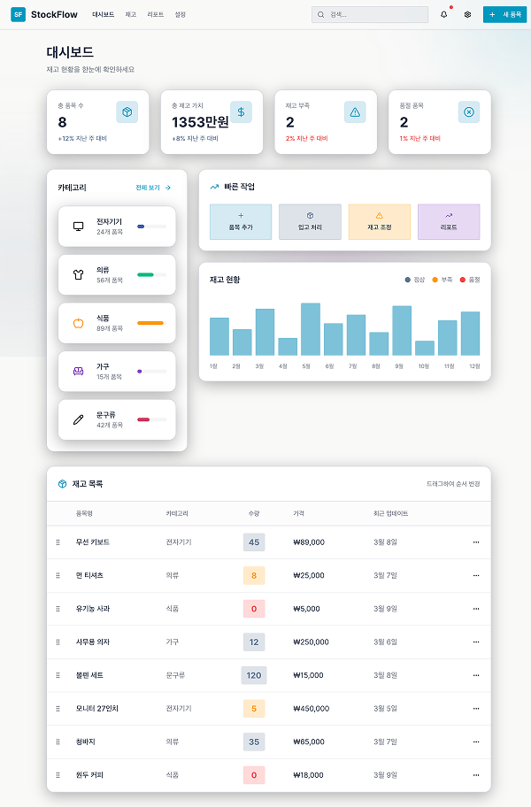
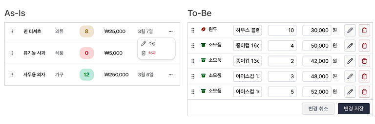
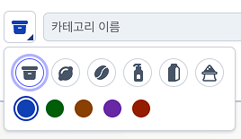
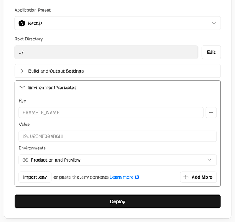

## [v0](https://v0.app)
> Vercel이 만든 AI 기반 UI빌더
- 자연어로 원하는 화면 생성
- React 컴포넌트 + shadcn/ui
- GitHub 연동 가능하며 Vercel로 바로 배포도 가능하다.

### 기술 스택
- Next.js
- shadcn/ui (Tailwind CSS)
- Supabase
- Vercel

### v0 결과
```
글래스모피즘 스타일로 재고관리 페이지 만들어 줘. 재고 목록은 드래그앤 드롭으로 순서 변경 가능하게.
```


- 헤더에 각 메뉴가 보이지만 위 대시보드 페이지 하나만 생성  
  &rightarrow; 사용할 메뉴[대시보드/재고/카테고리 설정] 수정 후 직접 페이지 추가
- mock 데이터라 실제 입력, 수정, 삭제할 수 있도록 재요청  
  &rightarrow; Supabase연결 후 CRUD 구현

## v0 환경에 추가 작업
- v0에서 직접 수정하면 연결이 자주 끊기고 노드 모듈도 간헐적으로 인식하지 못해 로컬환경에서 작업

### 1. 품목 추가, 품목 수정 팝업은 Radix UI dialog 로 변경
```tsx:title=modal.tsx
import * as Dialog from '@radix-ui/react-dialog';

<Dialog.Root open={isOpen} onOpenChange={onOpenChange}>
  <Dialog.Portal>
    <Dialog.Overlay />
    <Dialog.Content>
      ...
      <Dialog.Close asChild>
        <Button type="button" variant="outline">
          닫기
        </Button>
      </Dialog.Close>
    </Dialog.Content>
  </Dialog.Portal>
</Dialog.Root>
```
### 2. 카테고리 테이블과 재고 아이템 테이블(아이템의 카테고리) 연결
- Supabase sql로 수정
```sql
CREATE TABLE IF NOT EXISTS inventory_items (
...
  category_id UUID NOT NULL REFERENCES categories(id) ON UPDATE CASCADE ON DELETE SET NULL,
...
)
```

### 3. 재고 상태 탭과 카테고리 탭 추가 (아이템 필터링)
- 필터 값을 `useSearchParams`로 받을 때 `<Suspense>` 사용해야함  
  (메인에서 바로가기할 경우)
```tsx
const fetchItems = async () => {
  setIsItemLoading(true);
  try {
    const dataItems = await inventoryApi.getItems(filters);
    setItems(dataItems);
  } catch (error) {
    console.error('Fetch Items Error', error);
  } finally {
    setIsItemLoading(false);
  }
};

export default function InventoryStock() {
  return (
    <Suspense
      fallback={
        로딩 컴포넌트
      }
    >
      <InventoryContent />
    </Suspense>
  );
}
```

### 4. UX 개선
- 아이템 수정 시 각 아이템 별 수정보다 한번에 수정 후 저장
- 드래그 앤 드롭 후 index 저장 (기존엔 화면에서만 순서 변경)
  

- 카테고리 아이콘 선택
  

### * API 레이어 (Supabase Method Chaining 캡슐화)
```ts:title=lib/api/inventory.ts

export const inventoryApi = {
  ...,
  async getItems({ category, status, search }: GetItemsParams): Promise<InventoryItem[]> {
    const categoryQuery = category ? '*, categories!inner(*)' : '*, categories(*)';
    let query = supabase.from('inventory_items').select(categoryQuery);

    if (category) query = query.eq('categories.id', category);
    if (status) query = query.eq('status', status);
    if (search) query = query.eq('status', status);

    const { data, error } = await query
      .order('sort_order', { ascending: true })
      .order('created_at', { ascending: false });

    if (error) throw new Error(error.message);
    return data as InventoryItem[];
  },
  ...
  // in() : 다중 필터 - 반복문 사용하지말고 필터로 한번에 처리
  // upsert() : Update + Insert - id 있는지 확인 후 한번에 Update
  async syncInventoryItems(items: InventoryItem[], idsToDelete: string[]): Promise<void> {
    if (idsToDelete.length > 0) {
      const { error } = await supabase.from('inventory_items').delete().in('id', idsToDelete);

      if (error) throw new Error(error.message);
    }

    if (items.length > 0) {
      const upsertData = items.map((item, index) => ({
        id: item.id,
        category_id: item.category_id,
        name: item.name,
        quantity: item.quantity,
        min_stock: item.min_stock,
        price: item.price,
        sort_order: index,
      }));

      const { error } = await supabase
        .from('inventory_items')
        .upsert(upsertData, { onConflict: 'id' });

      if (error) throw new Error(error.message);
    }
  },
  ...
}
```

## Vercel 배포하기
- Supabase의 Environment Variables 설정


### [재고 관리 프로토타입 바로가기](https://app-stock-lake.vercel.app/)
